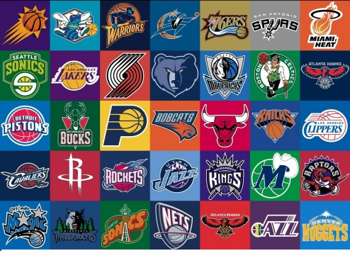

# nba-logos

<p align="center">
    
</p>

Team Members:
Gurveer Dhindsa, Abubakar Abdulsalam

# Getting Started
These instructions will get you a copy of the project up and running on your local machine for development and testing purposes.

### Prerequisites
For building and running the application you may need:
- [Jupyter Notebook](https://jupyter.org/install)

### Installing
First, clone this repository to your local machine using `https://github.com/AbubakarAbdulsalam/COMP4102_Project.git

### Running the application locally
Option 1:
To view the mode code, execute
```
jupyter notebook TrainedModel.ipynb
```
To view a sample rediction, execute
```
jupyter notebook SamplePrediction.ipynb
```

Option 2:
There is an option to view source code WITHIN GitHub/Google Colab. To do so, click on a .ipynb file within the GitHub repository.
Also, you can click the 'Open in Colab' button on the top of the .ipynb file to open it in Google Colab. This way you can run execute the file within your browser!
Note, running TranedMode.ipynb could take up to several hours as we are dealing with such a large dataset.

# 1. Abstract
This project is aimed towards classifying and detecting 30 National Basketball Association (NBA) teams in the current 2020 season. This can assist the general population in identifying and learning about the various teams by simply taking a photograph containing a logo. The photograph can be anything ranging from a teams’ poster, merchandise item or the floorboards of the stadium.

# 2. Introduction
For this project, we are utilizing convolutional neural networks (CNN) for image classification. Neural networks have found a varying amount of use in classification problems over the past decade. Convolutional neural networks are however, used mostly with classification problems. A convolutional neural network is a special kind of feedforward neural network that  reduces the number of parameters in a deep neural network with many units without losing too much in the quality of the model. Convolution neural networks have found applications in image and text processing where they beat many previously established benchmarks. A feedforward neural network aims to approximate a function. The flow of information occurs in the forward direction. The challenges with this algorithm include the collection of significant enough dataset that is normally required by neural networks. We needed to also separate the different iterations, the logos of several teams have gone through from the present version being used.

# 3. Background
For non-basketball fans or fans alike, it may become difficult to distinguish the logos of the 30 different NBA teams. NBA stadiums and merchandise containing such logos can be troublesome for individuals with vision-related disabilities as they may not know the team associated with the logo. In this project, we aim to develop a classification system that accepts a square photograph of anything containing a logo. This photograph can consist of anything ranging from a teams’ poster, a merchandise item or the floorboards of their stadium. The photograph can contain various types of noise but only one requirement must be in place, a logo must be present. This project involves the use of a smartphone device by leveraging its camera technology. 

# 4. Approach
A neural network (NN), is a mathematical function y = fNN(x). So, for a 3-layer neural network that returns a scalar, fNN is represented by y = fNN(x) = f3(f2(f1(x))). Where f1 and f2 are vector functions of the following form fl(z) d=ef gl(Wlz + bl). The variable l is called the layer index and can span from 1 to any number of layers. The function gl is called an activation function. It is a fixed, usually nonlinear function. The parameters Wl (a matrix) and bl (a vector) for each layer are learned using the gradient descent algorithm by optimizing a particular cost function (such as MSE). A convolutional neural network being a variation of the feedforward neural network just works a bit differently to an FFNN. In images, pixels that are close to one another usually represent the same type of information: sky, water, leaves, fur, bricks, etc. The exception from the rule are the edges. CNN splits an image into square patches using a moving window approach. Numerous small sized filters are used to detect certain patterns in the square patches of an image since most useful information in an image is localized. An example is given below, assuming the size of the square patches used is 3 and that P is a sample patch of a grayscale image with P.

A filter would need to learn to detect the pattern contained in this patch of image, and the size of that filter would be a 3 x 3 matrix.  The values contained in these filters are called parameters. Parameters at positions corresponding to the 1s in the image patch would be positive, while parameters in positions corresponding to the 0s in the image patch would be close to zero. When the image patch is convolved with the filter matrix, the higher the resultant value, the more similar the filter matrix is to the image patch. An example is shown in Figure 1 when the result of the convolution is 12. If the shape of the matrix P (input patch) is changed even slightly, say element at row 1, column 2 is changed to a 0. The convolution with the filter matrix F becomes 10, which signifies less similarity to the filter F.


# 5. References
A. Burkov, The hundred-page machine learning book. Quebec, Canada?: Andriy Burkov, 2019.

Upadhyay, Y. (2019, March 8). Feed forward Neural Networks. Retrieved from https://towardsdatascience.com/feed-forward-neural-networks-c503faa46620

